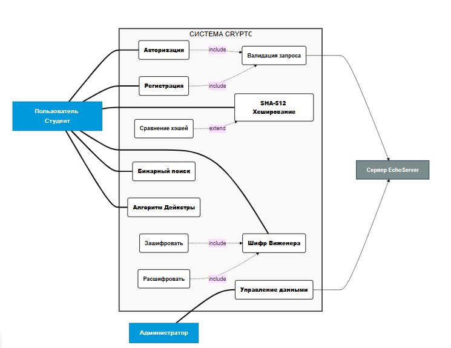

# Спецификация прецедентов (Use Case Specification)
**Проект:** Кроссплатформенное приложение криптографических методов и алгоритмов (Qt6 / C++)
**Версия:** 1.0  
**Дата:** 2026-06-01

---

## 1. Актеры (Actors)

| Актер | Тип | Описание |
| :--- | :--- | :--- |
| **Пользователь (User)** | Основной | Студент или клиент системы, использующий математические алгоритмы и криптомодули. |
| **Администратор (Admin)** | Основной | Пользователь с повышенными правами, управляющий учетными записями и просматривающий логи. |
| **Сервер (Server)** | Второстепенный | Внешняя система (эхо-сервер), обрабатывающая запросы, проверяющая авторизацию и имитирующая работу с БД. |

---

## 2. Диаграмма прецедентов (Структурное описание)

Визуально диаграмма разделена на три системных блока (границы системы):

### Блок А: Безопасность и Доступ
* **Прецедент:** Авторизация (Вход в систему)
* **Прецедент:** Регистрация нового аккаунта
* **Связи:** * `Регистрация` и `Авторизация` включают в себя (`<<include>>`) прецедент `Отправка запроса на Сервер`.
    * `Отправка запроса` включает в себя (`<<include>>`) прецедент `Валидация формата данных (parse)`.

### Блок Б: Криптография и Алгоритмы (Бизнес-логика)
* **Прецедент:** Использовать криптомодуль SHA-512
    * `<<extend>>` -> Проверить хэш на соответствие (сравнение строк).
* **Прецедент:** Использовать Шифр Виженера
    * `<<include>>` -> Зашифровать текст по ключу.
    * `<<include>>` -> Расшифровать текст по ключу.
    * `<<extend>>` -> Ограничение ввода (валидация латиницы).
* **Прецедент:** Использовать Бинарный поиск (в упорядоченном массиве).
* **Прецедент:** Использовать Алгоритм Дейкстры (поиск кратчайших путей).

### Блок В: Администрирование (Перспектива расширения)
* **Прецедент:** Просмотр таблицы пользователей / Логов.
* **Прецедент:** Изменение ролей (клиент / сервер).

---

## 3. Подробное описание ключевых прецедентов (Сценарии)

### Прецедент 1: Авторизация пользователя (Основной успешный сценарий)

* **Идентификатор:** UC-01
* **Главный актер:** Пользователь
* **Второстепенный актер:** Сервер
* **Предусловие (Pre-conditions):** Приложение запущено, активно окно `LoginWindow`.
* **Основной поток (Basic Flow):**
    1. Пользователь вводит логин и пароль в соответствующие поля.
    2. Пользователь нажимает кнопку «Войти».
    3. Система выполняет локальную проверку на пустые поля.
    4. Система формирует строку протокола передачи (`auth&login&password`).
    5. Система скрывает окно авторизации и открывает главное меню `UserWindow`.
* **Альтернативный поток (Alternative Flow - Ошибка авторизации):**
    * 3а. Поля ввода пустые -> Система выводит предупреждение и блокирует отправку.
    * 5а. Сервер/заглушка возвращает статус `auth&fail` -> Система оставляет окно логина активным и выводит сообщение «Неверные данные».

---

### Прецедент 2: Использование Шифра Виженера

* **Идентификатор:** UC-02
* **Главный актер:** Пользователь
* **Предусловие:** Пользователь успешно авторизован и перешел в раздел «Шифр Виженера» из главного меню.
* **Основной поток (Шифрование):**
    1. Пользователь вводит исходный текст на латинице.
    2. Пользователь вводит ключевое слово.
    3. Пользователь нажимает кнопку «Зашифровать».
    4. Система вызывает статический метод `VigenereCipher::encrypt`.
    5. Результат (шифртекст) отображается в поле вывода (`resultEdit`).
* **Расширение (Extension - Попытка ввода недопустимых символов):**
    * 1а / 2а. Пользователь пытается ввести кириллицу или цифры -> Встроенный валидатор `QRegularExpressionValidator` игнорирует нажатия клавиш, разрешая ввод исключительно символов `[a-zA-Z ]`.

---

### Прецедент 3: Генерация и проверка SHA-512

* **Идентификатор:** UC-03
* **Главный актер:** Пользователь
* **Предусловие:** Пользователь открыл криптомодуль SHA-512.
* **Основной поток (Сравнение хэшей):**
    1. Пользователь вводит строку текста.
    2. Пользователь вставляет ранее полученный эталонный хэш (128 символов) в поле сравнения.
    3. Пользователь нажимает кнопку «Проверить соответствие».
    4. Система генерирует SHA-512 хэш от введенного текста.
    5. Система сравнивает полученный хэш с эталонным в нижнем регистре.
    6. Система выводит зеленую метку «✅ СОВПАДЕНИЕ!» при идентичности строк.

---

## 4. Матрица трассировки (Связь требований и тестов)

| Код Use Case | Название прецедента | Целевой модуль в коде | Статус Unit-теста |
| :--- | :--- | :--- | :--- |
| **UC-01** | Авторизация и парсинг строк | `functionsforserver` / Заглушка | Готов (`test_parsing`) |
| **UC-02** | Шифр Виженера | `VigenereCipher` | Готов (`test_vigenere_cipher`) |
| **UC-03** | Хеширование SHA-512 | `SHA512` | Готов (`test_sha512_hash`) |

